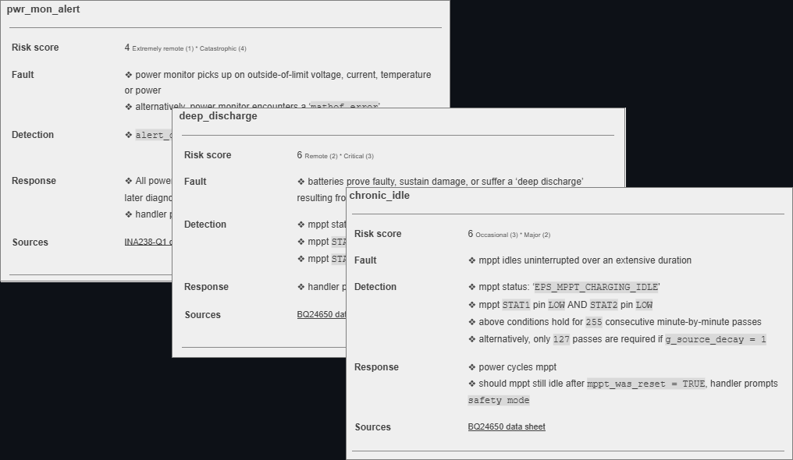

# 🛰️ stm32-fault-handler

Firmware fault detection and recovery routines for STM32 microcontrollers.

Adapted from modules developed for the CubeSat Electrical Power System (EPS) of the University of Toronto Aerospace Team (UTAT). Implements diagnostic logic for runtime fault monitoring and recovery.

## Implemented Fault Cases

- chronic_idle(): Detects persistent idling of the MPPT under expected charge conditions.
- source_decay(): Flags long-term degradation in solar or battery input; adjusts tolerance thresholds.
- pwr_mon_read_error(): Validates power-monitor readout consistency to ensure sensor health.

> Includes selected fault-handling drivers developed May-Sep 2024.
> Built under STM32CubeIDE using HAL-based drivers.

